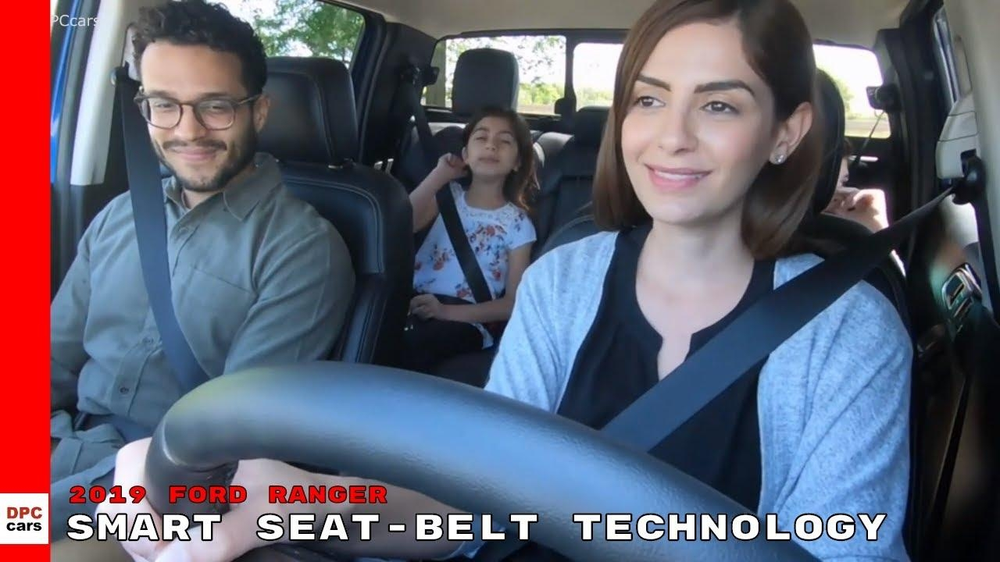

# Seatbelt Detection with YOLOv11 & Streamlit

A real-time web application that detects seatbelt usage in vehicle images using the YOLOv11 object detection model from Ultralytics and an interactive Streamlit interface.

---

## ✨ Features

- **YOLOv11-based** detection for people with and without seatbelts in car images
- **Streamlit UI** for quick image upload and instant visualization of results
- **Custom-trained weights (`best.pt`)** optimized for seatbelt detection scenarios
- **Easy deployment** on Hugging Face Spaces or any cloud/server environment

---

## 🚀 Live Demo

Try the Seatbelt Detection app on Hugging Face Spaces:

👉 **[Seatbelt Detection – Hugging Face Space](https://huggingface.co/spaces/aditii27/Seatbelt-detection)**

---

## 🛠️ Tech Stack

| Component        | Technology                 |
|-----------------|---------------------------|
| Object Detection | Ultralytics **YOLOv11**   |
| Web Framework    | Streamlit 1.40.1          |
| Language         | Python 3.x                |
| Deployment       | Hugging Face Spaces       |
| Model Weights    | Custom `best.pt` detector |

---

## 📁 Project Structure

```
seatbelt-detection-using-yolov11/
├── .streamlit/        # Streamlit configuration
├── images/            # Sample input/output images
├── app.py             # Main Streamlit application
├── best.pt            # Trained YOLOv11 seatbelt model
├── yolov11.pt         # Base YOLOv11 model weights (optional)
├── requirements.txt   # Python dependencies
├── packages.txt       # System-level packages for Spaces
├── .dockerignore      # Docker ignore configuration
├── .gitattributes     # Git attributes
└── README.md          # Project documentation
```

---

## ⚙️ Local Setup

### 1. Clone the Repository

```bash
git clone https://github.com/aditii27/seatbelt-detection-using-yolov11.git
cd seatbelt-detection-using-yolov11
```

### 2. (Optional) Create & Activate Virtual Environment

```bash
python -m venv venv

# Windows
venv\Scripts\activate

# Linux / macOS
source venv/bin/activate
```

### 3. Install Dependencies

```bash
pip install -r requirements.txt
```

### 4. Run the Streamlit App

```bash
streamlit run app.py
```

Then open `http://localhost:8501` in your browser.

---

## 🧠 How It Works

1. **Upload Image** – User uploads a car/vehicle image via Streamlit interface
2. **YOLOv11 Inference** – The `best.pt` model runs inference on the image
3. **Classification** – Detected people are classified as **seatbelt** or **no-seatbelt**
4. **Display Results** – Processed image with bounding boxes and confidence scores

---

## 🧪 Training Overview (Optional)

The deployed model is trained with Ultralytics YOLO on a custom seatbelt dataset.

Example YOLOv11 training command:

```bash
yolo task=detect mode=train model=yolov11n.pt data=seatbelt.yaml epochs=100 imgsz=640
```

Replace `seatbelt.yaml` with your dataset configuration path.

---

## 🐳 Docker Usage (Optional)

If you add a `Dockerfile`, build and run with:

```bash
docker build -t seatbelt-yolo11 .
docker run -p 8501:8501 seatbelt-yolo11
```

---

## 📷 Sample Results

Add your own images under `images/` folder and update paths below:

| Input Image | Output (Detections) |
|------------|---------------------|
|  |  |

---

## 🤝 Contributing

1. Fork the repository
2. Create a new branch: `git checkout -b feature/your-feature-name`
3. Commit your changes: `git commit -m "Add some feature"`
4. Push to the branch: `git push origin feature/your-feature-name`
5. Open a Pull Request

---

## 📄 License

This project is licensed under the **MIT License**.  
See the `LICENSE` file or repository settings for more details.

---

## 👨‍💻 Author

**Aditii27**

GitHub: [github.com/aditii27](https://github.com/aditii27)

**If you find this project useful, consider starring the repo ⭐ to support the work!**
